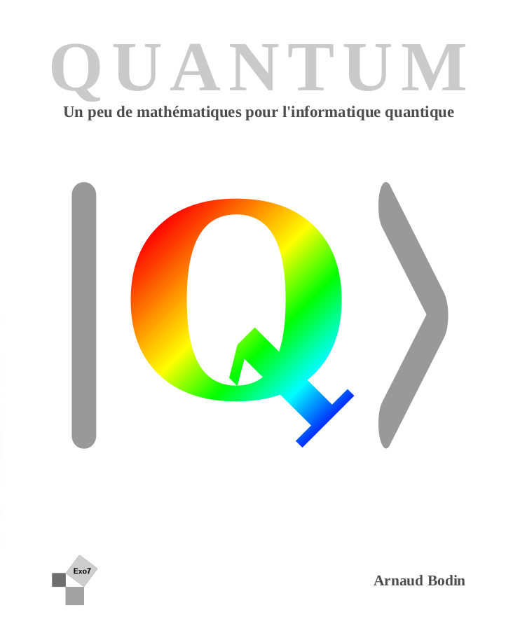
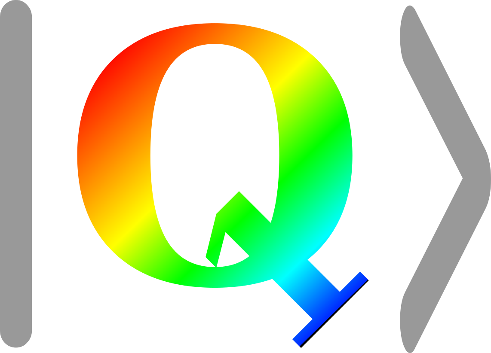

Quantum : Un peu de mathématiques pour l'informatique quantique
===============================================================

Livre
=====

Vous pouvez télécharger le livre sur ce site : [Livre 'Quantum' (4 Mo)](livre-quantum.pdf).

Vous pouvez obtenir une version papier en *noir et blanc* sur [Amazon](https://www.amazon.fr/dp/B09LGNKZY5/) à prix coûtant.

Vidéos
======

Tout le cours est aussi expliqué en vidéos ! [Chaîne Youtube "Quantum"](https://www.youtube.com/channel/UCgeO7CtfYSdWt0PPZ3vafqw/)

Chapitres
=========

Partie I - Premiers pas quantiques
----------------------------------

* Découverte [Chapitre](decouverte/decouverte.pdf)
* Utiliser un ordinateur quantique (avec Qiskit) [Chapitre](ordinateur/ordinateur.pdf)
* Nombres complexes [Chapitre](complexes/complexes.pdf)
* Vecteurs et matrices [Chapitre](vecteurs/vecteurs.pdf)
* Informatique classique [Chapitre](classique/classique.pdf)
* Physique quantique [Chapitre](physique/physique.pdf)
* Téléportation quantique [Chapitre](teleportation/teleportation.pdf)

Partie II - Algorithmes quantiques
----------------------------------

* Un premier algorithme quantique [Chapitre](algorithme/algorithme.pdf)
* Portes quantiques [Chapitre](portes/portes.pdf)
* Algorithme de Deutsch--Jozsa [Chapitre](deutsch/deutsch.pdf)
* Algorithme de Grover [Chapitre](grover/grover.pdf)

Partie III - Algorithme de Shor
-------------------------------

* Arithmétique [Chapitre](arithmetique/arithmetique.pdf)
* Algorithme de Shor [Chapitre](shor/shor.pdf)
* Compléments d'arithmétique [Chapitre](complement/complement.pdf)
*  Transformée de Fourier discrète [Chapitre](fourier/fourier.pdf)

Partie IV - Vivre dans un monde quantique
-----------------------------------------

* Cryptographie quantique [Chapitre](crypto/crypto.pdf)
* Code correcteur [Chapitre](code/code.pdf)
* Avantage quantique [Chapitre](avantage/avantage.pdf)

Codes
=====

Vous trouverez les fichiers sources en naviguant dans les répertoires de [GitHub "quantum"](https://github.com/exo7math/quantum-exo7).

Erreurs
=======

Merci de signaler toutes les éventuelles fautes (de calcul, de programmation, d’orthographe).

Auteur
======

Arnaud Bodin

Je remercie Michel Bodin, Stéphanie Bodin, François Recher et Jean-Michel Torres pour leurs relectures.

Ce livre est diffusé sous la licence *Creative Commons -- BY-NC-SA -- 4.0 FR*.

